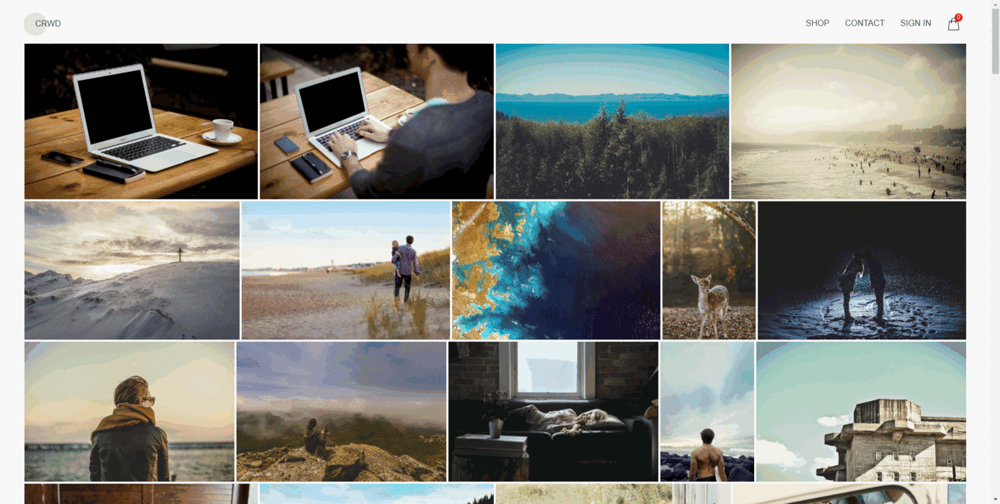

<h1 style="text-align: center;">CRWD React App</h1>

# About
Designed and built SPA using React/Redux. Landing page use [Image Layout Algorithm](http://blog.vjeux.com/2014/image/google-plus-layout-find-best-breaks.html) to show full-width (justified) gallery. Implemented shop data and photos API. Used Styled Components. Deployed to Firebase hosting. All used technologies you can find bellow.

# Demo
http://crwd-2020.web.app

# Screenshots

# How to run

## Installing
`npm install`

## Running
`npm start`

# Used technologies
* [React](https://reactjs.org/)
* [React Router](https://reacttraining.com/react-router/)
* [Redux](https://redux.js.org/)
* [Redux Thunk](https://github.com/reduxjs/redux-thunk/)
* [React Leaflet](https://react-leaflet.js.org/)
* [TypeScript](https://www.typescriptlang.org/)
* [Styled Components](https://styled-components.com/)
* [Axios](https://github.com/axios/axios/)
* [ESLint](https://eslint.org/)
* [Prettier](https://prettier.io/)
* [Lorem Picsum](https://picsum.photos/)
# License
[MIT](LICENSE)